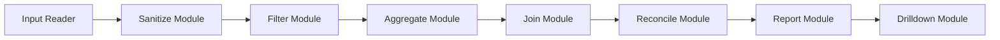

# ReconciliationFramework - Detailed Architecture & System Design

---

## 1. Overview of Architecture and Design Principles

ReconciliationFramework is designed as a modular, extensible, and configuration-driven system for reconciling two datasets. The primary goals are:

- **Modularity:** Each processing stage is encapsulated in its own module to isolate concerns and simplify maintenance.
- **Configurability:** The entire pipeline is driven by YAML configuration files, enabling non-developers to define reconciliation jobs without code changes.
- **Extensibility:** Clear extension points allow users to add new comparators, backends, and filters.
- **Scalability:** Optimized for large datasets (~5–6 million rows) on commodity hardware using efficient vectorized operations.
- **Auditable & Deterministic:** Outputs are stable and accompanied by audit logs and metrics for traceability.

The architecture follows a linear pipeline model, processing data through a series of stages: input reading → sanitizing → filtering → aggregation → join → reconciliation → reporting → optional drilldown.

---

## 2. Core Modules and Their Responsibilities

### 2.1 Sanitize Module

- **Purpose:** Standardizes input datasets by renaming columns, selecting relevant columns, trimming strings, and enforcing case normalization.
- **Key Functions:** Rename columns to a canonical schema, select subset of columns, normalize string data.
- **Design Note:** Ensures consistent column names and formats for downstream processing.

### 2.2 Filter Module

- **Purpose:** Applies vectorized filter predicates to datasets based on the YAML config.
- **Supported Operations:** Equality, inclusion (`in`), greater than, less than, etc.
- **Design Note:** Filters are applied early to reduce dataset size and improve performance.

### 2.3 Aggregate Module

- **Purpose:** Groups data by specified keys and computes aggregate metrics such as sum, count, and unique counts.
- **Design Note:** Aggregation keys and metrics are configurable per dataset side; aggregation output is used for reconciliation.

### 2.4 Join Module

- **Purpose:** Joins the two datasets (A and B) on specified keys with join types: inner, left, right, full (outer).
- **Features:** Coalesces join keys to unsuffixed columns for clarity; fills missing numeric values with zeros post-join.
- **Design Note:** Join keys are critical for aligning records; join type affects reconciliation scope.

### 2.5 Reconcile Module

- **Purpose:** Compares numeric columns from both datasets using configured comparators (absolute, relative, rounded).
- **Output:** Delta columns (absolute difference, signed difference, percentage difference), match flags.
- **Design Note:** Supports tolerance thresholds to handle minor acceptable differences.

### 2.6 Report Module

- **Purpose:** Generates output files including matched rows, non-matched rows, differences, metrics, and audit logs.
- **Formats:** CSV and Parquet supported.
- **Features:** Optionally relabels columns with friendly dataset names; supports selective output columns.

### 2.7 Drilldown Module

- **Purpose:** Provides hierarchical drill-down of reconciliation results by progressively adding or removing dimensions.
- **Use Case:** Pinpoints variance by granular keys like trade ID or date.
- **Design Note:** Drilldown levels are configured and results are saved in nested output folders.

---

## 3. Detailed Data Flow

```text
[Input CSVs A & B]
       │
       ▼
[Sanitize]  -- rename, select, normalize columns
       │
       ▼
[Filter]    -- apply vectorized predicates
       │
       ▼
[Aggregate] -- group by keys, compute metrics
       │
       ▼
[Join]      -- join datasets on keys (inner/left/right/full)
       │
       ▼
[Reconcile] -- compute deltas, apply tolerance, flag matches
       │
       ▼
[Report]    -- export matched, non-matched, differences, metrics
       │
       ▼
[Drilldown] -- optional iterative dimension add/remove for variance analysis
```

- **Data is loaded independently for each dataset.**
- **Sanitization ensures schema alignment.**
- **Filtering reduces data volume early.**
- **Aggregation prepares data for reconciliation at the chosen grain.**
- **Join aligns records for side-by-side comparison.**
- **Reconciliation applies numeric comparison logic.**
- **Reporting outputs final files for review and auditing.**
- **Drilldown enables detailed investigation of discrepancies.**

---

## 4. How Configuration Drives Execution

- The YAML configuration file fully specifies the job parameters.
- **Parsing:** The framework parses YAML into a structured job object.
- **Job Object:** Encapsulates inputs, filters, aggregation, join, reconciliation, reporting, and drilldown config.
- **Execution:** The pipeline engine consumes the job object, sequentially invoking each module with relevant config.
- **Dynamic Behavior:** Modules adapt processing based on config (e.g., different join types, filters, comparators).
- **Example:** Changing `join.type` from `inner` to `outer` alters join behavior without code changes.

---

## 5. Extensibility Points

- **Comparators:** Add new numeric comparison strategies by implementing comparator functions and registering them in the comparator registry.
- **Backends:** Support alternative data processing libraries (e.g., Polars, Dask) by implementing backend interfaces for data loading, filtering, aggregation, and joining.
- **Filters:** Extend filtering logic with new predicate types by adding to the filter registry; usable via YAML config.
- **Reports:** Customize report formats or add new output types by extending the reporting module.
- **Drilldown Strategies:** Implement new drilldown strategies beyond "add" and "remove" for advanced variance analysis.

---

## 6. Error Handling and Logging Strategy

- **Error Handling:** 
  - Validation of YAML config with descriptive messages.
  - Defensive checks at each pipeline stage for missing columns, type mismatches.
  - Graceful failure with clear error logs.
- **Logging:** 
  - Verbose logging option for debug-level details.
  - Audit logs capture runtime metrics, timing, and pipeline steps.
  - Logs are stored alongside output reports for traceability.
- **Design Note:** Emphasizes transparency and ease of troubleshooting.

---

## 7. Future Design Considerations

- **Distributed Processing:** Integrate with distributed backends (e.g., Spark) for massive datasets.
- **Incremental Reconciliation:** Support delta processing for streaming or incremental data.
- **GUI Configuration:** Develop a user interface for building YAML configs visually.
- **Enhanced Comparators:** Add machine learning based anomaly detection for reconciliation.
- **Data Lineage:** Track detailed data lineage for compliance.
- **Plugin System:** Formalize plugin architecture for third-party extensions.

---

# Architecture Diagram



*Note:* GitHub renders Mermaid diagrams natively. If viewing in an environment that does not support Mermaid, see the textual flow in the *Detailed Data Flow* section above.

---

This document aims to provide developers and advanced users with a clear understanding of the internal workings of ReconciliationFramework to facilitate customization, debugging, and extension.
